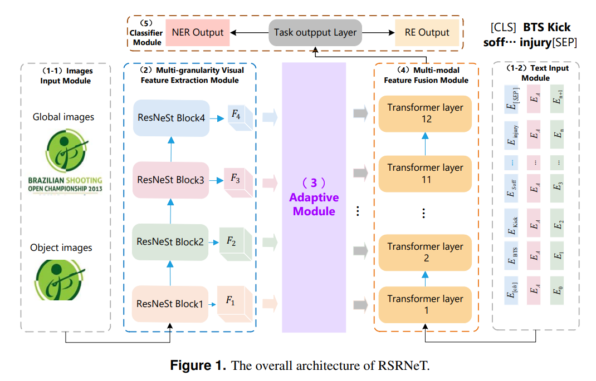
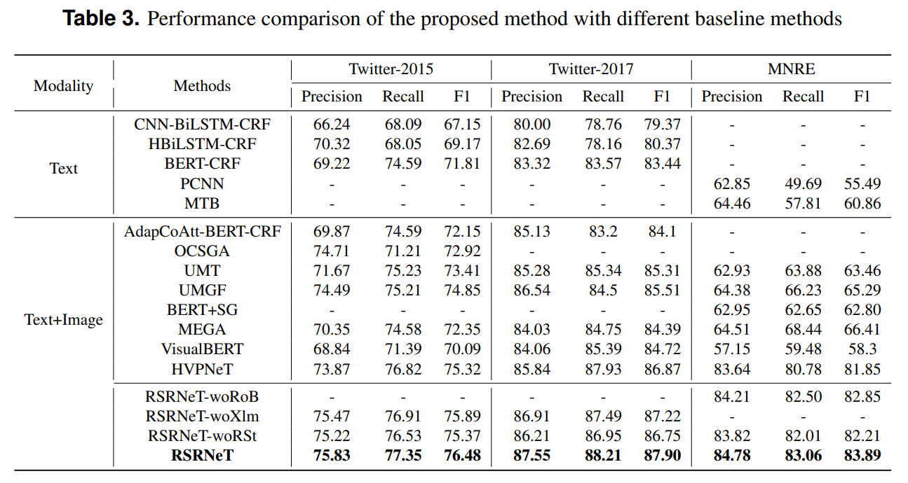

# SAVER

This repository now contains a paper-aligned SAVER implementation alongside
the original RSRNeT code.

The independent SAVER path uses:

- `answerdotai/ModernBERT-base` for text;
- `google/siglip2-base-patch16-naflex` for every attached image;
- a low-patch global screen for all attachments;
- a learned unit-level gate with an equal-input parameter-free MaxSim control;
- Top-1 attachment retrieval by default;
- high-patch SigLIP-2 re-encoding only for selected, active attachments;
- a direct marked-pair head for MRE and start/end/max/width span enumeration
  for MNER;
- exact text-only behavior when a gate is off; and
- an attachment-indexed patch bank that gathers only Top-R features instead
  of copying every detailed patch representation across all MNER spans.

The selector also implements a guarded `selection_type: facility` option for
real `K>=2` experiments. Configuration validation rejects facility-location
with `K=1`, because a one-image budget cannot support a cross-selected-image
diversity claim. Promote this option into the paper only if the five-seed,
cost-matched ablation beats ordinary relevance Top-K.

`models/saver.py` contains the architecture and simultaneous
Clopper--Pearson calibration rule. `processor/saver_dataset.py` contains the
shared multi-image JSONL data contract. `modules/saver_trainer.py` implements
forced-vision warm-up followed by gate-floor annealing, which prevents the
sparse router from collapsing before the visual branch learns useful
evidence. Training preserves `last.pt`, then reloads the best development
checkpoint before calibration; `best.pt` and `final.pt` are deployment-ready.

## SAVER setup

Install the new path independently from the frozen legacy environment:

```shell
python -m pip install -r requirements-saver.txt
```

Convert each official split to the schema in
`data/manifest_schema.md`, then update the paths in
`configs/saver_mre_mi.yaml` and `configs/saver_mner_mi_plus.yaml`.

Validate a manifest without downloading either backbone:

```shell
python run_saver.py --config configs/saver_mre_mi.yaml --mode validate-data
```

Train one experiment:

```shell
python run_saver.py \
  --config configs/saver_mre_mi.yaml \
  --mode train \
  --seed 42 \
  --output-dir result/saver_mre_mi/seed_42
```

Run the five-seed, single-GPU protocol on an NVIDIA A800 80GB:

```shell
bash scripts/run_saver_a800.sh
```

Profile a calibrated checkpoint with three runs, each using 100 warm-up and
300 measured iterations. The timer excludes disk I/O and model loading, but
includes preprocessing, host-to-device transfer, both backbone stages,
routing, and the task head:

```shell
bash scripts/profile_saver_a800.sh \
  configs/saver_mre_mi.yaml \
  result/saver_mre_mi/seed_42/final.pt
```

Run the network-free unit suite:

```shell
python -m unittest discover -s tests -v
```

Paper tables are deliberately not duplicated in this README. The per-seed
`resolved_config.yaml`, `run_metadata.json`, `metrics.json`,
`test_predictions.jsonl`, `calibration.json`, checkpoints, and
`latency.json` are the only sources from which manuscript values should be
filled.

## Legacy RSRNeT

### The overall architecture of RSRNeT.


### Performance comparison of the proposed method with different baseline methods


Requirements
==========
To run the codes, you need to install the requirements:
```
pip install -r requirements.txt
```

Data Preprocess
==========
To extract visual object images, we first use the NLTK parser to extract noun phrases from the text and apply the [visual grouding toolkit](https://github.com/zyang-ur/onestage_grounding) to detect objects. Detailed steps are as follows:

1. Using the NLTK parser (or Spacy, textblob) to extract noun phrases from the text.
2. Applying the [visual grouding toolkit](https://github.com/zyang-ur/onestage_grounding) to detect objects. Taking the twitter2015 dataset as an example, the extracted objects are stored in `twitter2015_aux_images`. The images of the object obey the following naming format: `imgname_pred_yolo_crop_num.png`, where `imgname` is the name of the raw image corresponding to the object, `num` is the number of the object predicted by the toolkit. (Note that in `train/val/test.txt`, text and raw image have a one-to-one relationship, so the `imgname` can be used as a unique identifier for the raw images)
3. Establishing the correspondence between the raw images and the objects. We construct a dictionary to record the correspondence between the raw images and the objects. Taking `twitter2015/twitter2015_train_dict.pth` as an example, the format of the dictionary can be seen as follows: `{imgname:['imgname_pred_yolo_crop_num0.png', 'imgname_pred_yolo_crop_num1.png', ...] }`, where key is the name of raw images, value is a List of the objects.

The detected objects and the dictionary of the correspondence between the raw images and the objects are available in our data links.

Data Download
==========

+ Twitter2015 & Twitter2017

    The text data follows the conll format. You can download the Twitter2015 data via this [link](https://drive.google.com/file/d/1qAWrV9IaiBadICFb7mAreXy3llao_teZ/view?usp=sharing) and download the Twitter2017 data via this [link](https://drive.google.com/file/d/1ogfbn-XEYtk9GpUECq1-IwzINnhKGJqy/view?usp=sharing). Please place them in `data/NER_data`.

    You can also put them anywhere and modify the path configuration in `run.py`

+ MNRE

    The MNRE dataset comes from [MEGA](https://github.com/thecharm/MNRE), many thanks.

    You can download the MNRE dataset with detected visual objects via this [link](https://drive.google.com/file/d/1Jv6peX4fWkz33fWRC4WC3Wl9RNyHX6aC/view?usp=sharing) or use the folloing commands:
    ```bash
    cd data
    wget 120.27.214.45/Data/re/multimodal/data.tar.gz
    tar -xzvf data.tar.gz
    mv data RE_data
    ```

The expected structure of files is:

```
RSRNET
 |-- data
 |    |-- NER_data
 |    |    |-- twitter2015  # text data
 |    |    |    |-- train.txt
 |    |    |    |-- valid.txt
 |    |    |    |-- test.txt
 |    |    |    |-- twitter2015_train_dict.pth  # {imgname: [object-image]}
 |    |    |    |-- ...
 |    |    |-- twitter2015_images       # raw image data
 |    |    |-- twitter2015_aux_images   # object image data
 |    |    |-- twitter2017
 |    |    |-- twitter2017_images
 |    |    |-- twitter2017_aux_images
 |    |-- RE_data
 |    |    |-- img_org          # raw image data
 |    |    |-- img_vg           # object image data
 |    |    |-- txt              # text data
 |    |    |-- ours_rel2id.json # relation data
 |-- models	# models
 |    |-- bert_model.py
 |    |-- modeling_bert.py
 |-- modules
 |    |-- metrics.py    # metric
 |    |-- train.py  # trainer
 |-- processor
 |    |-- dataset.py    # processor, dataset
 |-- logs     # code logs
 |-- run.py   # main
 |-- run_ner_task.sh
 |-- run_re_task.sh
```

Train
==========

## NER Task

The data path and GPU related configuration are in the `run.py`. To train ner model, run this script.

```shell
bash run_twitter15.sh
bash run_twitter17.sh
```

## RE Task

To train re model, run this script.

```shell
bash run_re_task.sh
```

Test
==========
## NER Task

To test ner model, you can use the tained model and set `load_path` to the model path, then run following script:

```shell
python -u run.py \
      --dataset_name="twitter15/twitter17" \
      --bert_name="bert-base-uncased" \
      --seed=1234 \
      --only_test \
      --max_seq=80 \
      --use_prompt \
      --prompt_len=4 \
      --sample_ratio=1.0 \
      --load_path='your_ner_ckpt_path'

```

## RE Task

To test re model, you can use the tained model and set `load_path` to the model path, then run following script:

```shell
python -u run.py \
      --dataset_name="MRE" \
      --bert_name="bert-base-uncased" \
      --seed=1234 \
      --only_test \
      --max_seq=80 \
      --use_prompt \
      --prompt_len=4 \
      --sample_ratio=1.0 \
      --load_path='your_re_ckpt_path'

```

Acknowledgement
==========

The acquisition of Twitter15 and Twitter17 data refer to the code from [UMT](https://github.com/jefferyYu/UMT/), many thanks.

The acquisition of MNRE data for multimodal relation extraction task refer to the code from [MEGA](https://github.com/thecharm/Mega), many thanks.

We make improvements based on [HVPNeT](https://github.com/zjunlp/HVPNeT), many thanks.
